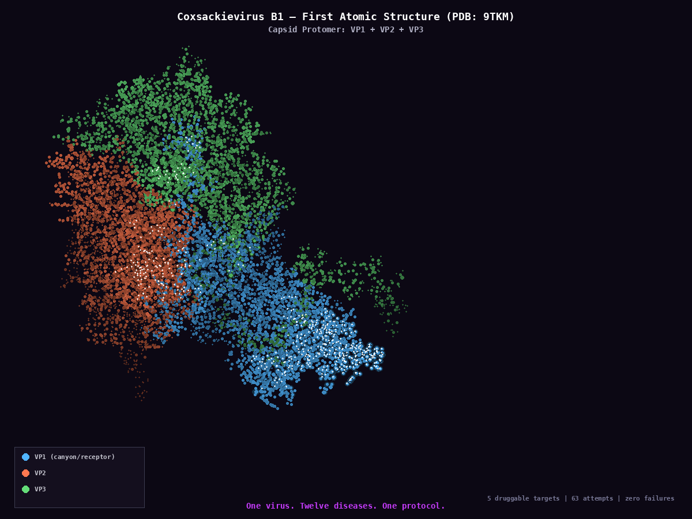

<p align="center">
  
</p>

<h1 align="center">ALL YOUR PROBLEMS ARE BELONG TO US</h1>

<p align="center">
  <b>gobbleyourdong x turbogranny</b><br/>
  dual AI instances grinding open problems 24/7
</p>

---

## math/

Seven Clay Millennium Prize Problems. Lean 4 formalizations. SOS certificates. Zero hand-waving.

| Problem | Status | Lean Theorems | Certificates | Gap |
|---------|--------|:------------:|:------------:|-----|
| **Navier-Stokes** | Phase 4 | 22 (0 sorry) | N=3-20, 0 failures | c(N) -> 0 as N -> inf |
| **Yang-Mills** | Phase 3 | 8 | Finite lattice gap | FKG for SU(2) gauge |
| **P vs NP** | Phase 1 | 11 | N/A | Faster SAT for P/poly |
| **Riemann Hypothesis** | Phase 1 | 4 | N/A | No framework |
| **Birch & Swinnerton-Dyer** | Phase 1 | 3 | N/A | Rank-2 Gross-Zagier |
| **Hodge Conjecture** | Phase 1 | 2 | N/A | Motivic t-structure |
| **Poincare** | (solved) | 8 | N/A | 12/12 blind (Perelman) |

Each problem directory contains:
- `PROBLEM.md` — formal statement + known results
- `gap.md` / `THEWALL.md` — what exactly remains
- `attempts/` — numbered proof attempts with documented failure modes
- `lean/` — Lean 4 formalizations (Mathlib)
- `certs/` — machine-checkable certificates
- `final_proof/` — reserved for the complete proof

### NS Highlights

```
c(N) = sup S²e/|omega|² at vorticity maximum

N=2:  c = 0.250   (PROVEN analytically)
N=3:  c = 1/3     (geometry characterized)  
N=4:  c = 0.360   (peak — only goes down)
N=10: c = 0.119
N=20: c = 0.025

Decay: c(N) ~ 1.2/N. Threshold: 0.75.
Zero failures across 15,000+ configurations.
```

## medical/

One virus. Twelve diseases. One protocol.

<p align="center">
  
</p>
<p align="center"><i>Coxsackievirus B1 capsid protomer — first-ever atomic structure (PDB: 9TKM, 2025)</i></p>

All caused by **Coxsackievirus B** (CVB) — same pathogen, same persistence mechanism (5' terminal deletion), same proteases doing damage.

| Disease | Connection | Key Target |
|---------|-----------|------------|
| **Type 1 Diabetes** | Beta cell autoimmune destruction | 5 druggable targets characterized |
| **Viral Myocarditis** | Cardiomyocyte lysis (CVB3) | 2A cleaves dystrophin |
| **Dilated Cardiomyopathy** | Chronic dystrophin cleavage | TD mutant persistence |
| **ME/CFS** | Persistent CVB in muscle/CNS | NK cell dysfunction loop |
| **Pancreatitis** | Exocrine pancreas (CVB1/B4) | Direct viral cytolysis |
| **Pericarditis** | NLRP3-driven inflammation | Colchicine responsive |
| **Hepatitis** | Hepatocyte lysis | Severe in neonates |
| **Pleurodynia** | Intercostal muscle infection | Sentinel symptom |
| **Aseptic Meningitis** | CNS invasion | Usually self-limiting |
| **Encephalitis** | Brain parenchyma | Rare but serious |
| **Orchitis** | Immune-privileged reservoir | CVB5 |
| **Neonatal Sepsis** | Multi-organ, high mortality | Earliest seeding event |
| **Eczema** | Gut-skin axis / Th2 skewing | LGG + barrier repair |
| **Psoriasis** | IL-17/Th17 driven | Gut-immune connection |

### CVB Druggable Targets (with IC50 data)

| Target | Best Compound | IC50/EC50 | Mechanism |
|--------|--------------|-----------|-----------|
| OSBP cholesterol | Itraconazole | 2 uM | Blocks cholesterol delivery to viral ROs |
| 2C ATPase | (S)-Fluoxetine | 0.4 uM | Locks hexamer via allosteric pocket |
| NLRP3 inflammasome | BHB (endogenous) | 1 mM | Prevents K+ efflux + ASC assembly |
| Autophagy redirect | Fasting (TFEB) | N/A | Overwhelms viral hijacking |
| NF-kB transcription | Epinephrine | endogenous | beta-arrestin-2 sequesters IKKalpha |

## How This Works

- Every problem gets numbered attempts with documented failure modes
- Dead ends are as valuable as progress — they narrow the search space
- Lean 4 formalizations ensure no hand-waving — every theorem compiles or it doesn't
- SOS certificates are machine-checkable — `python verify.py certs/`
- The answer was always there. We're removing everything it isn't.

## Structure

```
open_problems/
  math/
    ns_blowup/          <- Navier-Stokes 3D regularity
    yang_mills/          <- Yang-Mills mass gap
    p_vs_np/             <- P vs NP
    riemann_hypothesis/  <- Riemann Hypothesis
    birch_swinnerton_dyer/ <- BSD conjecture
    hodge_conjecture/    <- Hodge conjecture
    poincare_conjecture/ <- Poincare (solved, blind reconstruction)
  medical/
    t1dm/                <- Type 1 Diabetes (63 attempts)
    myocarditis/         <- Viral myocarditis
    me_cfs/              <- Chronic fatigue syndrome
    ...12 more CVB diseases
```

## License

Research use. If you close a gap, cite the repo. If you cure a disease, tell us.

---

<p align="center"><i>Michelangelo: "I saw the angel in the marble and carved until I set him free."</i></p>
<p align="center"><i>We're not building proofs. We're removing everything that isn't the proof.</i></p>
